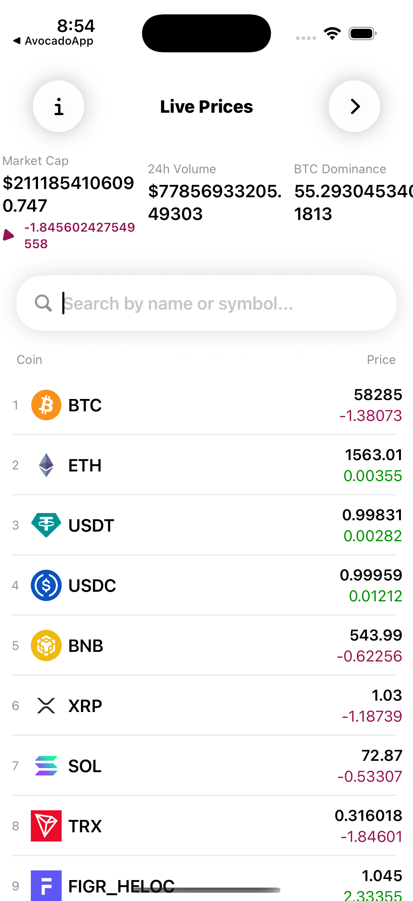

# 📈 SwiftfulCrypto

A modern cryptocurrency tracking application built entirely with **SwiftUI**.

The app fetches real-time cryptocurrency market data from a public API, allowing users to browse coins, search by name or symbol, and monitor live market statistics.

This project demonstrates API integration, networking, JSON decoding, reusable SwiftUI components, and clean project organization.

---

## 📱 Screenshot

| Live Market |
|------------|
|  |

---

## ✨ Features

- 📊 Live cryptocurrency market data
- 🔍 Search coins by name or symbol
- 💰 Real-time price updates
- 📈 Market statistics
- 🪙 Coin ranking
- 📉 24-hour price change
- 🌎 Global crypto market overview
- 🚀 Fast and responsive SwiftUI interface
- 📱 Native iOS application

---

# 🛠 Technologies

- Swift 5
- SwiftUI
- URLSession
- REST API
- JSON Decoding (Codable)
- MVVM-inspired Architecture
- Async Networking
- SF Symbols
- Xcode

---

# 📂 Project Structure

```
SwiftfulCrypto
│
├── Assets
│
├── Utilities
│   ├── NetworkingManager.swift
│   ├── Color.swift
│   ├── Double.swift
│   └── UIApplication.swift
│
├── Services
│   ├── CoinDataService.swift
│   ├── CoinImageService.swift
│   └── MarketDataService.swift
│
├── Model
│   ├── CoinModel.swift
│   ├── MarketDataModel.swift
│   └── StatisticModel.swift
│
├── Core
│   └── ContentView.swift
│
└── SwiftfulCryptoApp.swift
```

---

# 🚀 Key Concepts

This project demonstrates:

- SwiftUI
- REST API Integration
- URLSession Networking
- Codable
- JSON Parsing
- ObservableObject
- @Published
- State Management
- Search Functionality
- Reusable Components
- Modular Project Structure
- Data Formatting
- Custom Extensions

---

# 🌐 API

The application retrieves real-time cryptocurrency market data from a public cryptocurrency API.

Data includes:

- Coin Name
- Symbol
- Current Price
- Market Cap
- Trading Volume
- Market Rank
- 24 Hour Price Change
- Global Market Statistics

---

# ▶️ Getting Started

### Requirements

- Xcode 15+
- iOS 17+
- Swift 5.9+

### Installation

```bash
git clone https://github.com/sandeep9607/cryptoswiftui.git
```

Open the project in Xcode and run it on an iOS Simulator or a physical device.

---

# 📚 What I Learned

While building this project, I gained hands-on experience with:

- SwiftUI
- Networking using URLSession
- API Integration
- Codable
- JSON Decoding
- ObservableObject
- MVVM-inspired Design
- Custom Extensions
- Search & Filtering
- Reusable Services
- Project Organization

---

# 🔮 Future Improvements

- Coin Detail Screen
- Interactive Price Charts
- Portfolio Management
- Favorite Coins
- Dark Mode
- Unit Tests
- Swift Charts Integration
- Offline Cache
- Widget Support

---

# 👨‍💻 Author

**Sandeep Maurya**

Senior iOS Engineer

- Swift
- SwiftUI
- UIKit
- Combine
- Swift Concurrency
- Clean Architecture

If you found this project helpful, consider giving it a ⭐.
